# DataFlowDesk 사용자 매뉴얼

NeoSlon MES/ERP 인터페이스(시스템 연동) 정보를 Excel 대신 웹에서 한곳에서 관리하는 도구입니다.
"어떤 시스템이 누구와, 어떤 방식으로, 얼마나 자주 통신하는지"를 한눈에 확인할 수 있습니다.

## 목차

1. [시작하기 (설치·실행·로그인)](#1-시작하기)
2. [화면 구성](#2-화면-구성)
3. [대시보드](#3-대시보드)
4. [인터페이스 목록](#4-인터페이스-목록)
5. [시스템 관리](#5-시스템-관리)
6. [구성도](#6-구성도)
7. [변경 이력](#7-변경-이력)
8. [사용자 관리 (관리자)](#8-사용자-관리-관리자)
9. [설정 – 회사 로고/회사명](#9-설정--회사-로고회사명)
10. [Excel 양식 안내](#10-excel-양식-안내)
11. [권한 요약](#11-권한-요약)
12. [자주 묻는 질문](#12-자주-묻는-질문)

---

## 1. 시작하기

### 1.1 설치 및 실행 (관리자/운영 담당자용)

요구 사항: Python 3.11+, Node.js 18+. DB는 기본 SQLite이며 `.env`로 PostgreSQL / MSSQL 전환이 가능합니다.

```bash
# 1) 환경 설정
cp .env.example .env            # DB_TYPE, JWT_SECRET, ADMIN_PASSWORD 등 수정

# 2) 백엔드
cd backend
python -m venv .venv && source .venv/bin/activate
pip install -r requirements.txt
alembic upgrade head            # 테이블 생성
python seed.py                  # 초기 관리자 계정 + 샘플 데이터
uvicorn app.main:app --port 8000

# 3) 프론트엔드 (다른 터미널)
cd frontend
npm install
npm run dev                     # http://localhost:5173
```

운영 환경에서는 `.env`의 다음 값을 반드시 변경하세요.

| 항목 | 설명 |
|---|---|
| `JWT_SECRET` | 로그인 토큰 서명 키. 길고 무작위한 문자열 사용 |
| `ADMIN_USERNAME` / `ADMIN_PASSWORD` | `seed.py`가 최초 1회 생성하는 관리자 계정 (기본 `admin` / `admin1234`) |
| `SYSTEM_PASSWORD_KEY` | 시스템 접속 비밀번호 암호화 키 (Fernet). 비어 있으면 개발용 키가 사용되므로 운영에서는 반드시 설정 |

### 1.2 로그인

브라우저에서 접속하면 로그인 화면이 표시됩니다. 아이디/비밀번호를 입력하고 **로그인**을 누릅니다.

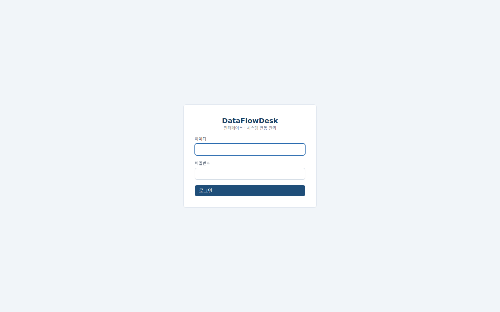

- 최초 계정: `admin` / `admin1234` (설치 후 즉시 변경 권장 → [8. 사용자 관리](#8-사용자-관리-관리자))
- 로그인 없이 다른 화면 주소로 접근하면 자동으로 로그인 화면으로 이동하고, 로그인 후 원래 화면으로 돌아갑니다.
- 30분 동안 사용이 없어도 로그인은 최대 7일간 자동으로 유지됩니다. 7일이 지나면 다시 로그인해야 합니다.
- 비활성화된 계정은 로그인할 수 없습니다.

### 1.3 로그아웃

좌측 하단의 사용자 이름 옆 **로그아웃**을 클릭합니다.

---

## 2. 화면 구성

| 영역 | 설명 |
|---|---|
| 좌측 상단 | 회사 로고/회사명 (설정에서 변경) |
| 좌측 메뉴 | 대시보드 · 인터페이스 목록 · 시스템 관리 · 구성도 · 변경 이력 · 사용자 관리(관리자만) · 설정 |
| 좌측 하단 | 현재 로그인 사용자(이름 · 아이디 · 권한), 로그아웃 |
| 우측 | 선택한 메뉴의 내용 |

일반적인 등록 순서: **시스템 관리**에 시스템을 먼저 등록 → **인터페이스 목록**에서 소스/타켓(경유) 시스템을 선택해 인터페이스 등록 → **구성도**·**대시보드**에서 확인.

---

## 3. 대시보드

로그인 후 첫 화면입니다. 현재 등록 현황을 요약합니다.

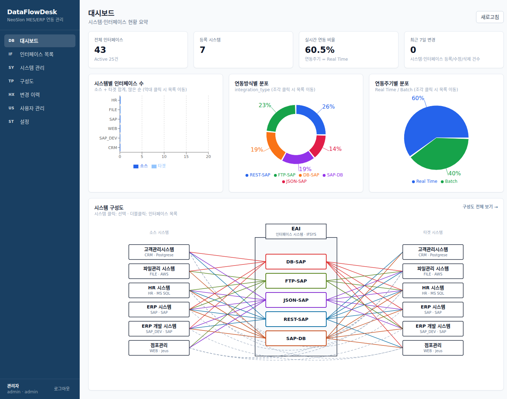

| 요소 | 설명 | 클릭 시 |
|---|---|---|
| 전체 인터페이스 / 전체 시스템 | 등록 건수 | 목록 화면으로 이동 |
| 실시간 비율 | 연동주기가 `Real Time`인 인터페이스 비율 | – |
| 최근 7일 변경 | 최근 7일간 기록된 변경 이력 건수 | 변경 이력 화면으로 이동 |
| 시스템별 인터페이스 (막대) | 시스템별 소스/타켓으로 참여한 인터페이스 수 | 해당 시스템으로 필터된 인터페이스 목록 |
| 연동방식 분포 (도넛) | DB-SAP, REST-SAP 등 연동방식별 건수 | 해당 연동방식으로 필터된 목록 |
| 연동주기 분포 (파이) | Real Time / Batch 비율 | 해당 주기로 필터된 목록 |
| 구성도 | [6. 구성도](#6-구성도)와 동일한 다이어그램 | – |

---

## 4. 인터페이스 목록

시스템 간 인터페이스를 검색·등록·수정·삭제하고 Excel로 업로드/다운로드합니다.

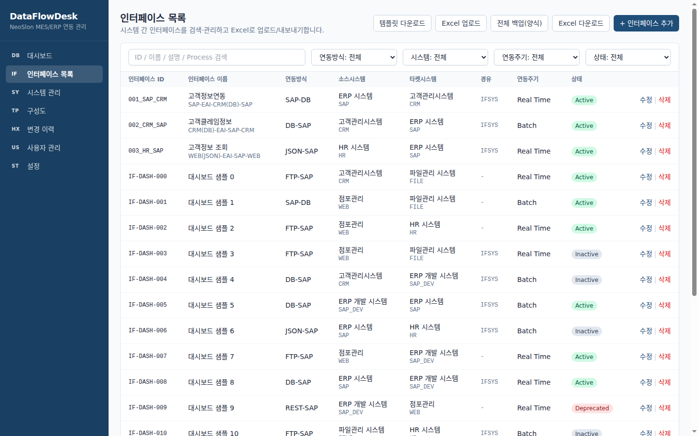

### 4.1 검색·필터

- 검색창: 인터페이스 ID / 이름 / 설명 / Process 부분 일치
- 드롭다운: 연동방식 · 시스템(소스 또는 타켓) · 연동주기 · 상태
- 조건은 조합 가능하며, 하단 페이지 이동(20건 단위)과 함께 유지됩니다.

### 4.2 인터페이스 추가/수정

우측 상단 **+ 인터페이스 추가**, 또는 행의 **수정**을 클릭합니다.

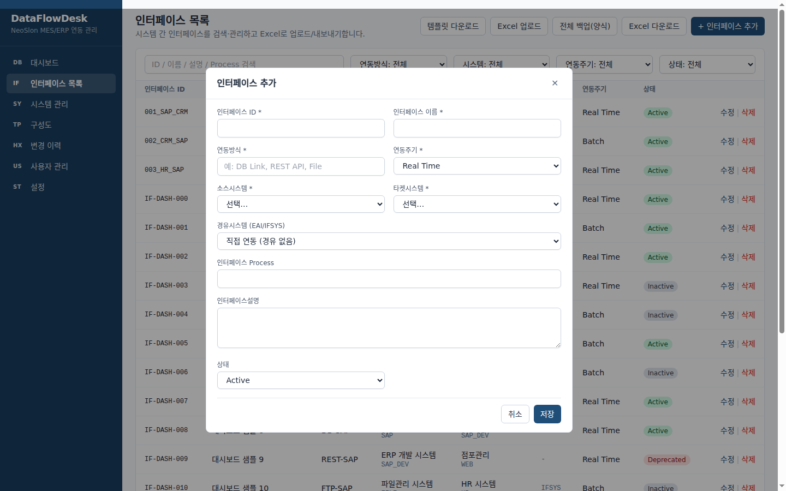

| 항목 | 필수 | 설명 |
|---|---|---|
| 인터페이스 ID | O | 고유 식별자 (예: `001_SAP_CRM`). 중복 불가 |
| 인터페이스 이름 | O | 표시 이름 |
| 연동방식 | O | 자유 입력 (예: `DB-SAP`, `REST-SAP`, `SAP-DB`, `FTP-SAP`). 구성도의 EAI 박스 안 노드 이름으로 사용되므로 표기를 통일하세요 |
| 연동주기 | O | `Real Time` / `Batch` |
| 소스시스템 / 타켓시스템 | O | 시스템 관리에 등록된 시스템 중 선택 |
| 경유시스템 (EAI/IFSYS) | – | EAI 서버를 거치는 경우 선택. 비우면 "직접 연동"으로 구성도에 점선으로 표시 |
| 인터페이스 Process | – | 프로그램/프로시저/잡 이름 등 |
| 인터페이스설명 | – | 자유 기술 |
| 상태 | – | `Active`(기본) / `Inactive` / `Deprecated` |

### 4.3 삭제

행의 **삭제** → 확인. 삭제 내용은 변경 이력에 스냅샷으로 남습니다.

### 4.4 Excel 버튼

| 버튼 | 내용 |
|---|---|
| 템플릿 다운로드 | 빈 양식(시트 2개: 인터페이스 리스트, 시스템 연동정보). 일괄 등록 시 사용 |
| Excel 업로드 | 양식에 맞춘 파일 업로드. 시스템 시트 → 인터페이스 시트 순으로 처리되며, 같은 ID/코드가 있으면 갱신(upsert). 결과로 성공/건너뜀 건수와 행별 오류를 표시 |
| 전체 백업(양식) | 전체 인터페이스 + 시스템을 업로드 가능한 양식 그대로 내려받기 (백업/이관용) |
| Excel 다운로드 | **현재 검색·필터 조건**의 인터페이스 목록만 내려받기 (보고용) |

업로드 오류가 있으면 해당 행은 건너뛰고 나머지는 저장됩니다. 오류 행을 수정해 다시 업로드하면 됩니다.

---

## 5. 시스템 관리

연동 대상 시스템(ERP, DB, 서버 등)의 접속 정보를 관리합니다.

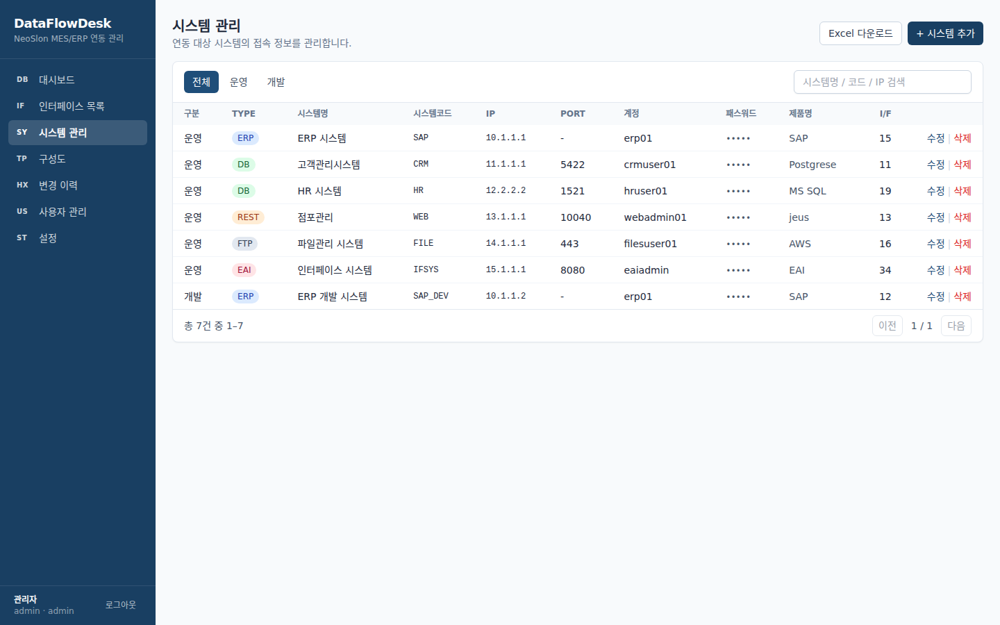

- 필터: 구분(운영/개발/스테이징) · 검색(시스템명/코드/IP)
- 패스워드는 기본 `•••••`로 가려지며, 행의 **표시**를 눌러 확인할 수 있습니다.
- **Excel 다운로드**: 현재 구분·검색 조건의 목록 (비밀번호 제외)

### 5.1 시스템 추가/수정

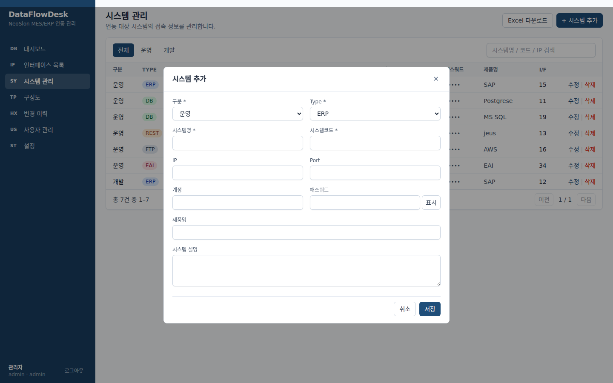

| 항목 | 필수 | 설명 |
|---|---|---|
| 시스템코드 | O | 고유 코드 (예: `SAP`, `CRM`, `IFSYS`). 인터페이스와 Excel에서 이 코드로 참조 |
| 시스템명 | O | 표시 이름 |
| 구분 | O | 운영 / 개발 / 스테이징 |
| Type | O | ERP / DB / REST / FTP / MQ / EAI |
| IP, Port, 계정, 패스워드 | – | 접속 정보. 패스워드는 암호화 저장, 변경 이력에는 `***`로만 기록 |
| 제품명 | – | SAP, PostgreSQL, TIBCO 등 |
| 시스템 설명 | – | 자유 기술 |

**EAI 서버 등록:** EAI(IFSYS)를 사용하는 경우 Type을 `EAI`로 하여 시스템으로 등록하고, 인터페이스의 "경유시스템"으로 선택하세요.

### 5.2 삭제

인터페이스에서 소스/타켓/경유로 사용 중인 시스템은 삭제할 수 없습니다. 관련 인터페이스를 먼저 삭제·변경하세요.

---

## 6. 구성도

인터페이스 목록을 바탕으로 **시스템 단위** 연결 관계를 그립니다 (인터페이스 개별 표시가 아님).

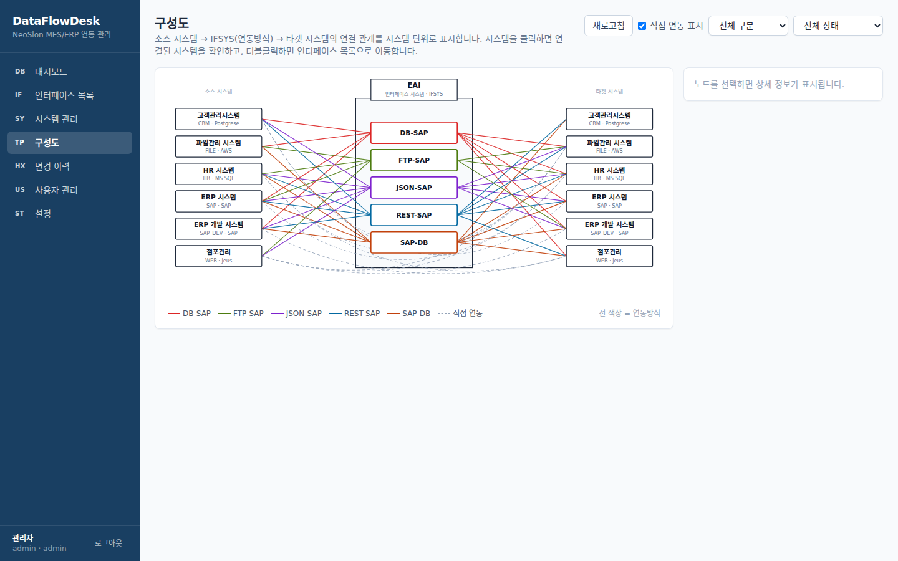

| 구성 | 의미 |
|---|---|
| 좌측 열 | 소스 시스템 |
| 중앙 EAI 박스 | 연동방식 노드 (SAP-DB, DB-SAP, REST-SAP …). 인터페이스의 "연동방식" 값에서 자동 생성 |
| 우측 열 | 타켓 시스템 |
| 실선 | 시스템 ↔ 연동방식 연결. 연동방식별 색상, **시스템당 연동방식마다 1개 선**만 표시 |
| 점선 | 경유시스템 없이 소스 → 타켓 직접 연동 |
| 하단 "인터페이스 미등록 시스템" | 시스템 관리에는 있으나 아직 인터페이스가 없는 시스템 |

사용법:

- 시스템 박스 클릭 → 우측 패널에 연결된 시스템 목록(시스템당 1행, 연동방식별 건수 표기)
- 시스템 더블클릭 → 해당 시스템으로 필터된 인터페이스 목록으로 이동
- **새로고침**: 다른 탭에서 시스템/인터페이스를 추가한 뒤 구성도를 갱신
- **직접 연동 표시** 체크를 해제하면 점선을 감출 수 있음
- 시스템이 많으면 카드 내부에서 스크롤됩니다 (범례는 고정)

---

## 7. 변경 이력

시스템·인터페이스의 등록/수정/삭제가 **자동으로** 기록됩니다. 사용자가 별도로 입력할 필요가 없습니다.

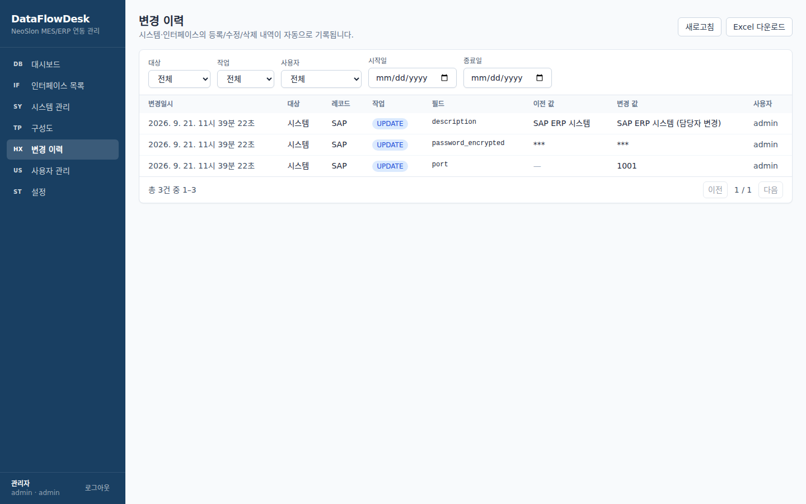

| 작업 | 기록 내용 |
|---|---|
| CREATE | 등록 시점의 전체 값 스냅샷 (행 클릭으로 펼침) |
| UPDATE | 변경된 **필드마다 1행**, 이전 값 → 변경 값 |
| DELETE | 삭제 직전의 전체 값 스냅샷 |

- 시스템 패스워드는 항상 `***`로 표시됩니다.
- 삭제된 레코드의 과거 이력도 원래 시스템코드/인터페이스 ID로 표시됩니다.
- 필터: 대상(시스템/인터페이스) · 작업 · 사용자 · 기간(시작일~종료일)
- **Excel 다운로드**: 현재 필터 조건의 이력을 내려받기 (감사/보고용)

---

## 8. 사용자 관리 (관리자)

`admin` 권한 사용자에게만 메뉴가 표시됩니다.

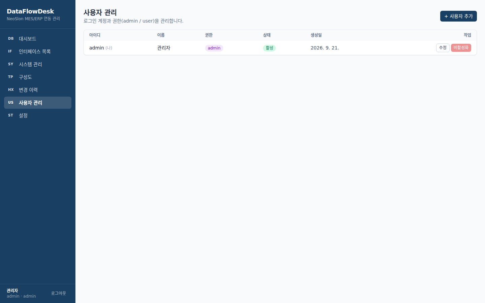

### 8.1 사용자 추가

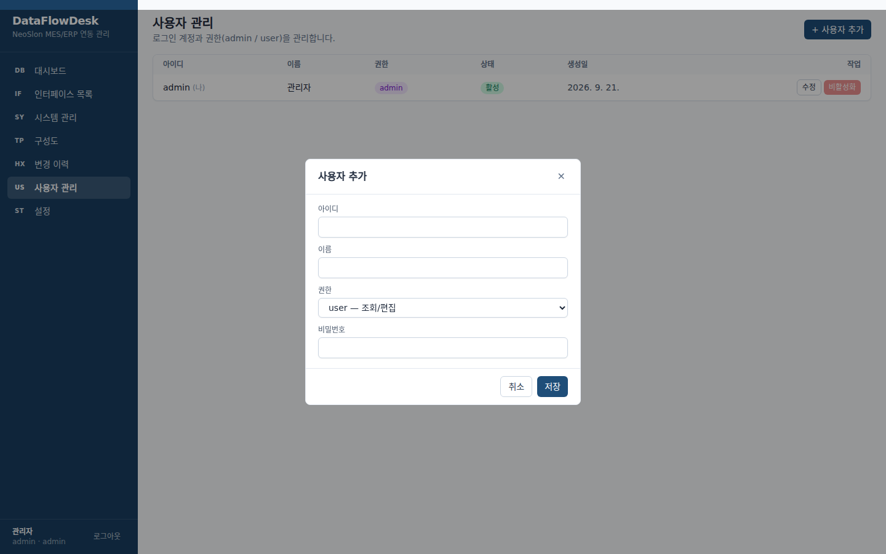

| 항목 | 설명 |
|---|---|
| 아이디 | 영문·숫자, 중복 불가 |
| 이름 | 표시 이름 |
| 비밀번호 | 초기 비밀번호 |
| 권한 | `user`(조회/편집) / `admin`(사용자 관리 포함) |

### 8.2 수정 · 비밀번호 초기화

행의 **수정** → 이름/권한 변경. "새 비밀번호" 칸에 값을 입력하면 비밀번호가 재설정되고, 비워두면 유지됩니다.
자기 자신의 비밀번호도 같은 방법으로 변경합니다 (초기 `admin` 비밀번호 변경 시 사용).

### 8.3 비활성화 / 활성화

퇴사·이동 등으로 접근을 막을 때 **비활성화**합니다(삭제 대신). 비활성 계정은 로그인이 거부되며, 이미 로그인된 세션도 다음 요청부터 차단됩니다. 필요 시 **활성화**로 복구합니다.

제한: 자기 자신은 비활성화할 수 없고, 자신의 권한을 `user`로 내릴 수 없습니다.

---

## 9. 설정 – 회사 로고/회사명

고객사별로 좌측 상단의 로고와 회사명을 바꿉니다. 저장 즉시 반영되며 서버 재시작이 필요 없습니다.

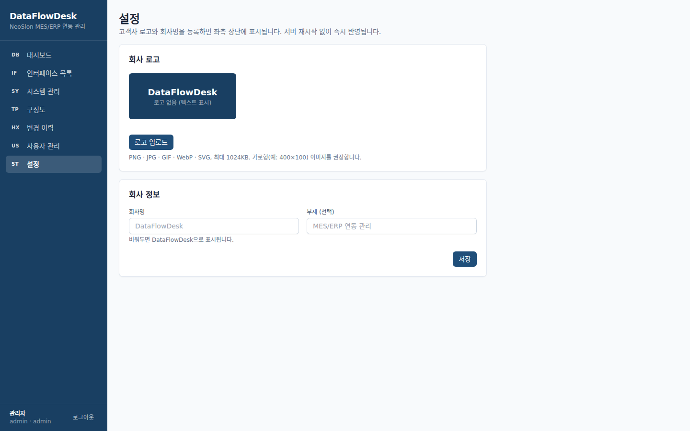

- **회사 정보**: 회사명, 부제(선택) 입력 후 **저장**. 부제를 비우면 기본 문구가 표시됩니다.
- **회사 로고**: PNG · JPG · GIF · WebP · SVG, 최대 1MB, 가로형(예: 400×100) 권장. **로고 삭제** 시 텍스트(회사명)로 표시됩니다.
- 로고/회사명은 로그인 화면에도 표시됩니다.

---

## 10. Excel 양식 안내

템플릿은 시트 2개로 구성됩니다. 1행은 헤더이며 **헤더 이름을 변경하면 업로드에 실패**합니다.

### 시트 1: `인터페이스 리스트`

| 열 | 필수 | 비고 |
|---|---|---|
| 인터페이스 ID | O | 고유 |
| 인터페이스 이름 | O | |
| 연동방식 | O | |
| 인터페이스 Process | – | |
| 소스시스템 | O | **시스템코드** 입력 (시스템 시트 또는 기존 등록 시스템) |
| 타켓시스템 | O | 시스템코드 |
| 경유시스템 | – | EAI 시스템코드 (열 자체를 생략 가능) |
| 연동주기 | O | `Real Time` 또는 `Batch` |
| 인터페이스설명 | – | |

### 시트 2: `시스템 연동정보`

| 열 | 비고 |
|---|---|
| 번호 | 순번(참고용) |
| 구분 | 운영 / 개발 / 스테이징 |
| Type | ERP / DB / REST / FTP / MQ / EAI |
| 시스템명, 시스템코드 | 시스템코드는 고유 |
| IP, Port, 계정, 패스워드 | 패스워드는 저장 시 암호화 |
| 제품명, 시스템 설명 | |

처리 규칙: 시스템 시트를 먼저 반영한 뒤 인터페이스 시트를 처리합니다. 존재하는 시스템코드/인터페이스 ID는 갱신, 없는 것은 신규 등록됩니다. 소스/타켓 시스템코드가 어디에도 없으면 해당 행은 오류로 건너뜁니다.

---

## 11. 권한 요약

| 기능 | user | admin |
|---|---|---|
| 대시보드 · 구성도 조회 | O | O |
| 인터페이스/시스템 등록·수정·삭제, Excel 업/다운로드 | O | O |
| 변경 이력 조회·다운로드 | O | O |
| 설정(로고/회사명) 변경 | O | O |
| 사용자 관리 | – | O |

---

## 12. 자주 묻는 질문

**Q. 구성도에 새로 추가한 시스템이 안 보입니다.**
구성도 우측 상단 **새로고침**을 누르세요. 인터페이스가 없는 시스템은 하단 "인터페이스 미등록 시스템"에 표시됩니다.

**Q. EAI를 사용하지 않는 사이트입니다.**
인터페이스 등록 시 경유시스템을 비워두면 됩니다. 구성도에는 소스 → 타켓 점선(직접 연동)으로 표시됩니다.

**Q. 시스템을 삭제할 수 없다고 나옵니다.**
그 시스템을 소스/타켓/경유로 쓰는 인터페이스가 있습니다. 인터페이스 목록에서 해당 시스템으로 필터해 먼저 정리하세요.

**Q. Excel 업로드에서 일부 행이 건너뛰어졌습니다.**
업로드 결과의 행별 오류 메시지를 확인하세요. 대부분 필수 열 누락, 존재하지 않는 시스템코드, 연동주기 오타(`Real Time`/`Batch`)입니다.

**Q. 갑자기 로그인 화면으로 돌아갑니다.**
로그인 유지 기간(7일)이 지났거나, 관리자가 계정을 비활성화한 경우입니다.

**Q. 변경 이력에 비밀번호가 `***`로만 보입니다.**
의도된 동작입니다. 비밀번호는 이력·Excel 어디에도 평문으로 남지 않습니다.
